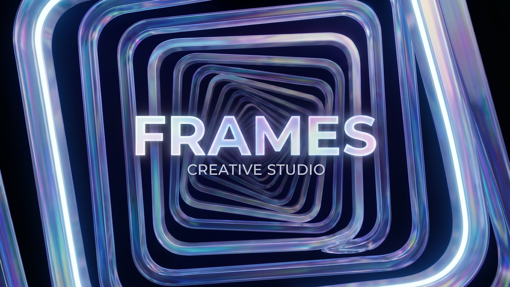

  

<h1 align="center">Frames</h1>

<strong>Frame-based VFX + AI-gen compositor for ComfyUI.</strong>

  Drag media onto a frame. Pick a template. Hit Run. The output lands back on the canvas,
  with a faint dashed line back to the inputs that produced it.

---

## What Frames is

Frames is a desktop app that wraps ComfyUI in a workflow most VFX artists already know: a board you can drop media onto, frames that hold a single shot, and templates that turn into a settings form so you never wire nodes by hand. ComfyUI runs locally or on a RunPod GPU; Frames pulls outputs back automatically and places them next to their inputs on the canvas.

- **No node wiring.** Templates declare the inputs (prompt, first-frame, control image, mask, etc.). The form is auto-generated. The wires happen on the ComfyUI side.
- **Frames are containers.** A Frame holds one shot's inputs (media + settings) and produces one set of outputs. Duplicate a Frame to fan out variants.
- **Lineage by default.** Every output knows which inputs and template produced it. Right-click any output → "Open source folder" or "Restore inputs" to reuse them on a new Frame.
- **Multi-pod aware.** Connect multiple RunPod endpoints; one is *focused* (where the next run goes), the others stay alive so their job progress keeps streaming into the Sampling dock.

---

## Install

> Frames is currently in **closed beta**. Activation requires approval — see [Activate](#activate) below.

### Windows

Download the latest `Frames-Setup-X.Y.Z.exe` from the [Releases page](https://github.com/richservo/frames-releases/releases/latest) and run it.

The installer pulls ~200 MB (CPU build) or ~2 GB (CUDA build) of PyTorch + supporting wheels during install. The progress is visible in the installer dialog — it isn't hung, it's downloading. NVIDIA GPU is auto-detected; CUDA wheels are picked when present.

Installs per-user under `%LOCALAPPDATA%\Programs\Frames`. No admin rights required. Everything Python lands inside the app directory — your system Python is never touched.

### macOS

Coming soon.

### Auto-updates

Once installed, Frames checks for updates on launch and applies them in the background. You'll get a toast when an update is ready; it installs on the next quit.

---

## Activate

> _Screenshot: the activation modal on first launch._

First launch shows the activation modal with two paths:

### Request access (closed beta)

1. Fill in name, email, and address.
2. Click **Request access**.
3. The screen flips to "Request submitted" and starts polling for approval every 5 seconds.
4. You can close the app — the next launch resumes on the polling screen.
5. Once approved, the screen activates automatically and the app boots.

Approval is typically within a few hours. Your information is encrypted in transit and stored only to issue and support your license.

### Already have a .rslicense file

If you received a `.rslicense` file directly:

1. Click **I have a .rslicense file already**.
2. Click **Choose .rslicense file…**.
3. Pick the file. It's verified and copied into your user data; the dialog dismisses.

The machine ID at the bottom of the modal is what bound (paid) licenses match against. Copy it if support asks.

---

## Quick start

> _Screenshot: the main window with the nav rail on the left and the Studio panel open._

1. **Add a pod** — open **Connection** in the left nav → **+ Add pod**. Paste a RunPod SSH connection line (the "Connect" tab in the pod's web UI) and give the profile a name. Connect.
2. **Open the Studio panel** — click **Studio** in the left nav. The canvas is the big empty space.
3. **Add a Frame** — toolbar → **Frame**. Pick a template from the dropdown in the Frame's header.
4. **Drop media** — drag a video or image from your OS / from the Files panel / from the canvas onto an empty input slot on the Frame.
5. **Hit Run** — the Run button is in the Frame's footer. Progress streams into the Sampling dock on the right.
6. **Done** — the output appears on the canvas next to the Frame, with a dashed line back to its inputs.

---

## Feature reference

### Connection panel

> _Screenshot: Connection panel showing two saved pods, one focused and connected._

- **Add pod** — three flavors: existing remote pod (paste an SSH line), new remote pod (full setup wizard with bootstrap monitor), or a local ComfyUI install on your machine.
- **Multi-pod** — connect more than one at once. The one you click becomes *focused*; everything interactive (Run, Files, embedded Comfy view, Resources monitor) targets the focused endpoint.
- **Why others stay connected** — so live job progress for runs already in flight on those endpoints keeps streaming into the Sampling dock. Switching focus doesn't kill them.

### Studio — the canvas

> _Screenshot: the Studio canvas with a Frame, two media cards, and an output placement._

An infinite pan/zoom board. Pan with middle mouse or trackpad two-finger drag. Zoom with the wheel. The toolbar across the top adds canvas widgets.

**Widgets you can add:**

| Widget | What it does |
|---|---|
| **Frame** | The run container. Pick a template, drop media into role slots, Run. |
| **Media card** | An image, a video, or an image sequence. Supports trim (in/out marks), retime, and resize. |
| **Timeline** | Scrub through a sequence of cards as if they were a video. |
| **SAM3 Mask** | Auto-generate masks from a text prompt or click points on an image. Runs locally on your GPU. |
| **Gemini Inpaint** | Inpaint a region using Google's Gemini API. |
| **Google Gen** | Generate / edit images via Google's gen-AI APIs. |
| **Ollama Chat** | Chat with a local Ollama model. Useful for prompt brainstorming inside the canvas. |
| **Sticky note** | Plain text annotation. |
| **LatLong** | Equirectangular / 360 helper for spherical workflows. |

> _Screenshot: the canvas toolbar showing the widget add menu._

### Frames + templates

> _Screenshot: a Frame with three role slots, two filled, one empty._

A **Frame** binds a *template* to a set of *placements* (media cards on the canvas).

- The template declares which inputs it expects (e.g. "first frame", "control video", "prompt").
- You bind a media card to a role by dragging it into the Frame's slot, or right-clicking the media card → **Use as → first frame**.
- The Frame's settings form is auto-generated from the template's exposed fields.
- The Run button executes when all required slots are filled.

**Important:** the Frame is the *sole source of truth* for what a run sees. Removing a media card from a slot removes it from the run. No hidden state.

#### Template editor

> _Screenshot: the template editor showing a workflow with three exposed fields._

Templates are ComfyUI workflows with their user-facing fields tagged. To author a template:

1. Build the workflow in the embedded ComfyUI view.
2. Open the template editor (Studio panel → top right → ⋯ menu).
3. For each node input you want to expose, tag it with a friendly name and a role type (image, video, mask, prompt, number, etc.).
4. Save. The template now appears in every Frame's dropdown.

### Run flow

> _Screenshot: a Frame mid-run with the Sampling dock streaming progress._

- **Run button** — submits the prompt to ComfyUI. The label tracks the run-queue state (Queued, Running, Idle).
- **Queue** — runs are FIFO per endpoint, one in flight at a time. Subsequent Runs queue locally and submit when the prior finishes.
- **Persistent** — queued + in-flight runs survive app reload. Boot recapture rebinds to the still-running prompt on the pod and resumes progress streaming.
- **Output placement** — when a run completes, its output is auto-placed on the canvas next to its Frame. A faint dashed line marks the input-to-output lineage.
- **Sampling dock** (right rail) — per-endpoint streaming progress: step count, ETA, current sampler / KSampler progress bars from ComfyUI's WebSocket.
- **Completions dock** — last N completed runs, click any row to reveal its output on the canvas.

### Embedded ComfyUI

> _Screenshot: the ComfyUI panel with a workflow loaded in the embedded view._

The **ComfyUI** panel in the left nav embeds the actual Comfy web UI of the focused endpoint. Useful for:

- Author / edit workflows that become templates.
- Verify a node graph by hand when a template misbehaves.
- Drop in custom nodes from the Manager.

Frames keeps the workflow JSON in sync with your local repo so edits persist across pod restarts. (Edits round-trip through ComfyUI's standard save flow — there's no special "save" button in Frames itself.)

### Files panel

> _Screenshot: Files panel showing the focused pod's /workspace tree._

Browse the focused endpoint's filesystem. Drag files from here onto the canvas (they're downloaded on demand and become media cards). Bookmark folders you visit often; the bookmarks bar pins them to the top.

### Resources panel + dock

> _Screenshot: the Resources dock at the bottom-right showing GPU / VRAM / CPU / RAM / disk._

1Hz live read of the focused endpoint's GPU(s), VRAM, CPU, system RAM, and `/workspace` disk usage. The dock at the bottom-right is the always-on indicator; the full Resources panel adds history charts.

### Actions panel

Common one-shot operations on the focused endpoint:

- **Kill ComfyUI** — terminates the comfy process.
- **Interrupt** — interrupts the currently running prompt.
- **Unload Ollama** — frees VRAM held by an idle Ollama model.
- **Health check** — runs a 4-stage probe (SSH, comfy HTTP, comfy WS, GPU).

### Logs panel

Live tail of `/workspace/comfyui.log`. Auto-reconnects on pod hiccups.

### Terminal panel

Full-featured pseudo-terminal into the focused endpoint, in case you need to hand-run something the UI doesn't expose.

### Settings panel

App-wide preferences:

- Default SSH key path
- Output / library root location
- HuggingFace auth (for SAM3 / model downloads)
- Google APIs (for Gemini Inpaint / Google Gen)

---

## Keyboard shortcuts

> Inside the Studio canvas, with a placement (media card, sticky, etc.) selected:

| Shortcut | Action |
|---|---|
| `Ctrl/⌘ + A` | Select all placements on the active board |
| `Ctrl/⌘ + C` | Copy selection |
| `Ctrl/⌘ + X` | Cut selection |
| `Ctrl/⌘ + V` | Paste at cursor (or cascade if cursor isn't over the canvas) |
| `Ctrl/⌘ + Z` | Undo (placement move/resize, retime, library item edits) |
| `Delete` / `Backspace` | Remove selected placements |
| `Esc` | Cancel an active marquee or close a modal |
| `←` / `→` | (in a video card) step one frame |
| `Home` / `End` | (in a video card) jump to first / last frame |
| `Ctrl/⌘ + Enter` | (in a prompt textarea) submit |

---

## Updates + support

Frames auto-updates on launch from the [`frames-releases`](https://github.com/richservo/frames-releases) repo. You'll see a toast when an update downloads; restart to apply.

To request support, report a bug, or share feedback: email **gentle.fury@gmail.com**. Include your machine ID (visible in the activation modal's footer) and a recent log snippet from the Logs panel if relevant.

---

## What's not in this build

- macOS installer (Windows only for now).
- Local-only mode without a connected pod (works for canvas + media organization, but Run requires a connected endpoint).
- Code-signing on Windows. The installer is unsigned for now — Windows SmartScreen will warn on first run. Click **More info → Run anyway**.

---

  © 2026 richservo · Frames Creative Studio

